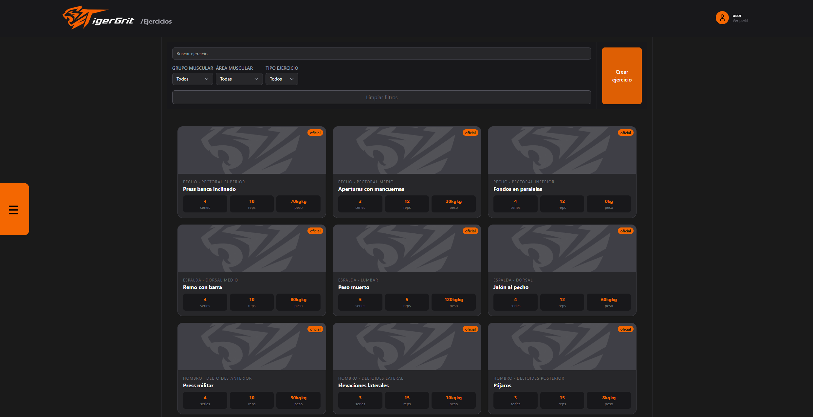
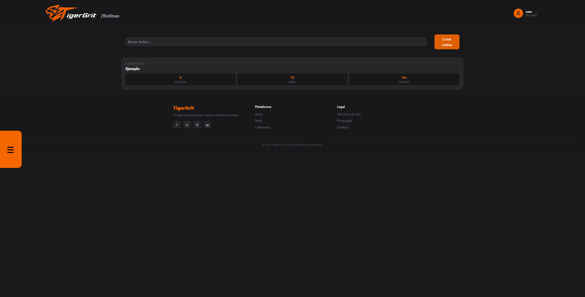
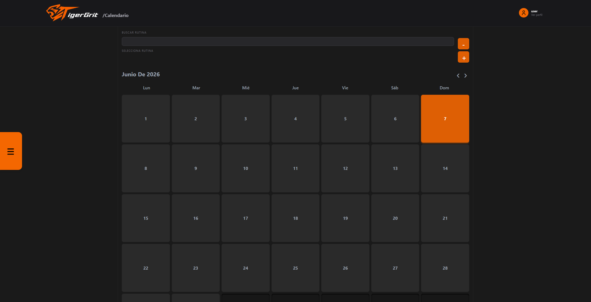

# TigerGrit

<p align="center">
  
</p>

<p align="center">
  Plataforma web para la gestión, planificación y seguimiento de entrenamientos deportivos.
</p>

<p align="center">


</p>

---

## Descripción

TigerGrit es una aplicación web desarrollada como Proyecto Fin de Grado del ciclo superior de Desarrollo de Aplicaciones Web (DAW).

La plataforma permite a los usuarios crear ejercicios personalizados, organizarlos en rutinas, planificar entrenamientos mediante un calendario interactivo y gestionar toda su actividad física desde una única aplicación.

El objetivo principal del proyecto es centralizar la planificación deportiva en un entorno intuitivo y visualmente atractivo, facilitando la adherencia a los hábitos de entrenamiento y mejorando la experiencia de organización personal.

Además, la arquitectura ha sido diseñada para permitir la futura incorporación de funcionalidades sociales como mensajería, grupos y comunidades.

---

## Funcionalidades principales

### Gestión de usuarios

* Registro de usuarios.
* Inicio y cierre de sesión.
* Autenticación mediante Laravel Sanctum.

### Gestión de ejercicios

* Creación de ejercicios personalizados.
* Edición de ejercicios propios.
* Eliminación de ejercicios propios.
* Biblioteca de ejercicios oficiales.
* Clasificación por grupos musculares.
* Clasificación por áreas musculares.
* Gestión de imágenes.

### Gestión de rutinas

* Creación de rutinas personalizadas.
* Asociación de ejercicios a rutinas.
* Edición y eliminación de rutinas.
* Visualización detallada de cada rutina.

### Calendario

* Planificación de entrenamientos.
* Asignación de rutinas a fechas específicas.
* Consulta de entrenamientos programados.
* Eliminación de planificaciones.

### Interfaz

* Diseño responsive.
* Componentes reutilizables.
* Sistema de filtros avanzados.
* Navegación optimizada para una experiencia fluida.

---

## Capturas de pantalla

### Biblioteca de ejercicios



### Gestión de rutinas



### Calendario de entrenamiento



---

## Tecnologías utilizadas

### Frontend

* React
* React Router
* Axios
* Tailwind CSS
* Vite

### Backend

* Laravel
* Laravel Sanctum

### Base de datos

* MySQL

### Control de versiones

* Git
* GitHub
* GitHub Desktop
* Pull Requests

---

## Estructura del proyecto

```text
TigerGrit
│
├── frontend/
│   ├── src/
│   ├── components/
│   └── pages/
│
├── backend/
│   ├── app/
│   ├── database/
│   ├── routes/
│   └── storage/
│
└── docs/
```

## Instalación

### Clonar repositorio

```bash
git clone https://github.com/Sabapie/TigerGrit.git
```

### Frontend

```bash
cd frontend
npm install
npm run dev
```

### Backend

```bash
cd backend
composer install
php artisan migrate
php artisan serve
```

---

## Trabajo futuro

Las próximas versiones del proyecto contemplan la incorporación de:

* Informacion extra sobre el usuario
* Configuracion de perfil + implementacion de fotos de perfil
* Informacion visual en relacion al area entrenada de los ejercicios
* Mejoras orientadas a dispositivos móviles.

---

## Autor

David Saba

Proyecto Fin de Grado — Desarrollo de Aplicaciones Web (DAW)

---

## Licencia

Proyecto desarrollado con fines académicos y educativos.
